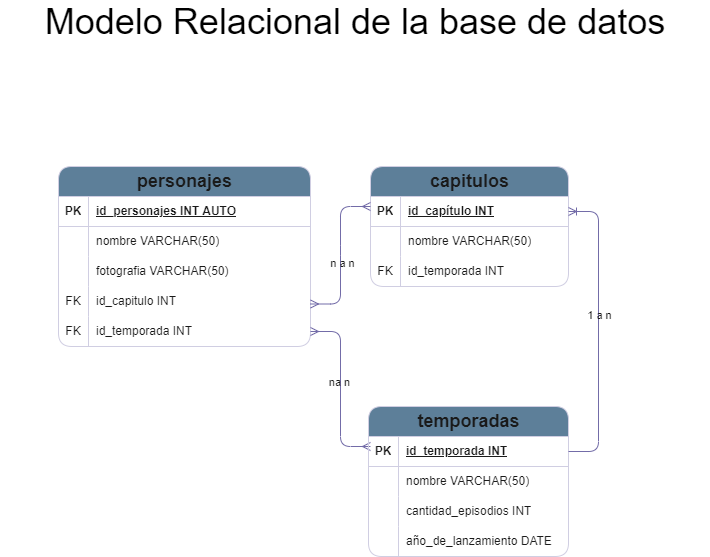

# Dragon Ball personajes
 
## Listado de entidades

### personajes **(ED)**
- id_personaje **(PK)**
- nombre
- foto
- id_capitulo **(FK)**
- id_temporada **(FK)**

### capitulos **(EC)**
- id_capitulo **(PK)**
- nombre
- id_temporada **(FK)**

### temporadas **(EC)**
- id_temporada **(PK)**
- nombre
- cantidad_episodios
- año_de_Lanzamiento

### relaciones
1. varios **personajes** aparecen en varios **capitulos**, varios **capitulos** pueden contener
varios **personajes**(n a n)
1. varios **personajes** aparecen en varias **temporadas**, varias **temporadas** pueden contener a
varios **personajes** (n a n)

### Modelo Relacional de la base de datos

### Glosario
- **(PK)**: _Primary Key_
- **(FK)**: _Forein Key_
- **(ED)**: Entidad de datos
- **(EC)**: Entidad Catálogo

### conclusion: 
#### Luego de modelar esta base de datos, llego a la conclusión de que optaria por utilizar una base de datos no relacional, ya que la información de una serie de anime es muy acotada en cuanto a la relación personajes-episodios-temporada y no tiene una gran escalabilidad.
#### utilizo un archivo Json para demostrar como podria modelar la información de los personajes(la información que contiene es a modo de ejemplo) para luego ser volcada en una pagina web.